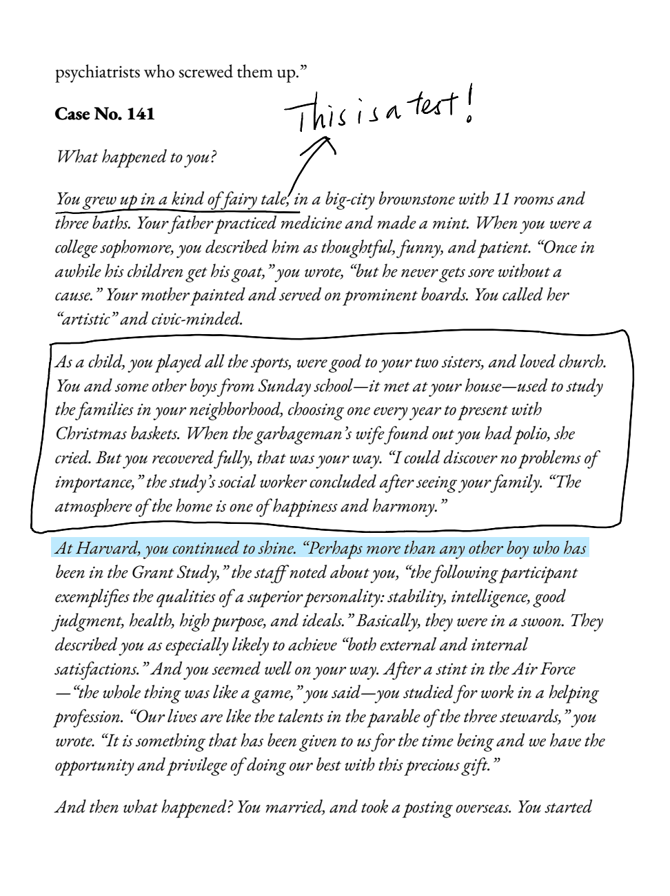
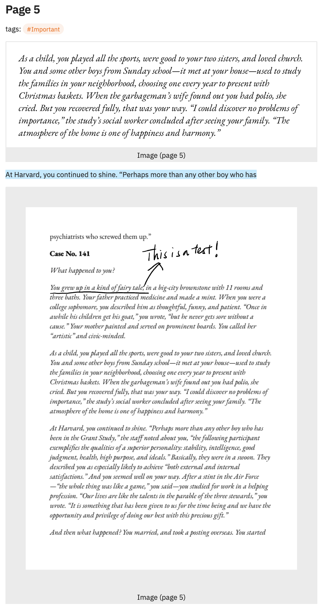
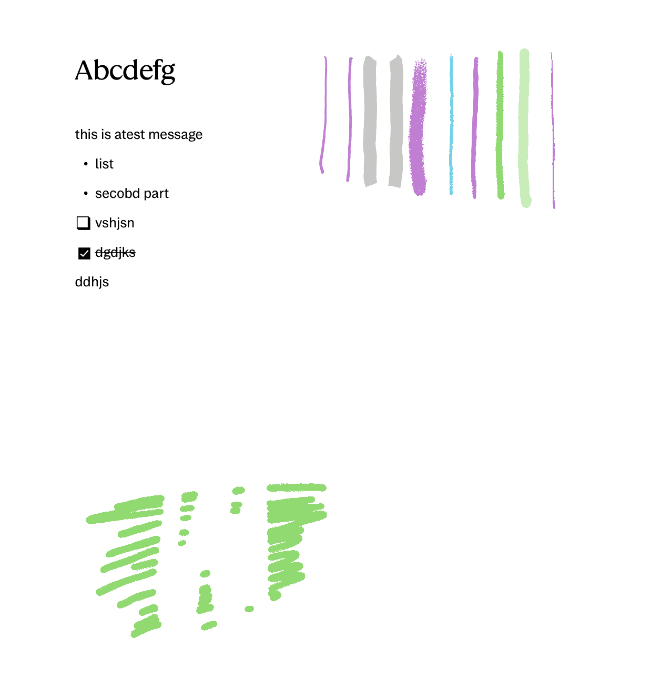
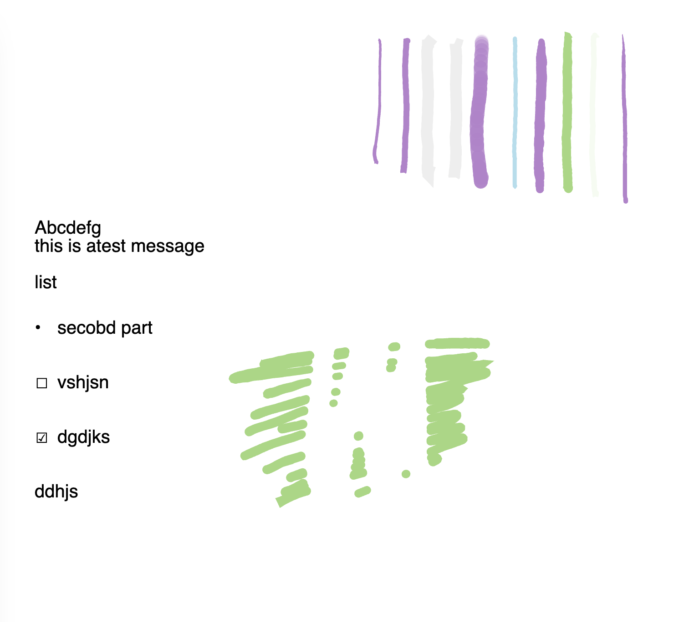

# rmrf

> **Warning**
> This project is under active development for my personal use. APIs may change.

rmrf is a Python library for processing and converting reMarkable tablet files (`.rm`). It provides utilities for parsing, rendering, and exporting reMarkable documents to Markdown and SVG. It is built on top of [rmscene](https://github.com/ricklupton/rmscene) and is mainly for my personal use.

## Features

- Only works locally with a reMarkable backup folder
- Parse reMarkable file formats (v3 or v6 in terms of lines format)
- Extract highlights and annotations from reMarkable files and convert them into Markdown or SVG, ideally for Obsidian

## Installation

To install rmrf, you need Python 3.10 or later. You can install it using pip:

```bash
pip install git+https://github.com/ChenghaoMou/rmrf.git
```

## Usage

Here's a basic example of how to use rmrf:

```python
from rmrf import FileSystem, MarkdownWriter, update, paper_title_getter
from rmrf.markdown import Highlight_Template, Page_Template, Template

BACKUP_DIR = Path("path to your reMarkable backup folder locally")
CACHE_DIR = Path("path to your cache folder locally")
TARGET_DIR = Path("path to your target obsidian folder locally")
STATIC_DIR = Path("path to your obsidian static folder locally")

fs = FileSystem(BACKUP_DIR, CACHE_DIR)
writer = MarkdownWriter(
    target_dir=TARGET_DIR,
    static_dir=STATIC_DIR,
    cache_dir=CACHE_DIR,
    title_getter=paper_title_getter,
    file_template=Template,
    highlight_template=Highlight_Template,
    page_template=Page_Template,
)
# Parse papers from the reMarkable backup folder 
# and export to Markdown in the target folder
update(
    fs=fs,
    prefix="/Root/Papers",
    writer=writer,
    force=True,  # overwrite existing files
)
```

## Templating Variables

For file template, you can use the following variables:

- `original_title`: the original title of the file
- `title`: the title of the file, escaped for markdown
- `alias`: the same as the original title
- `created`: the creation time of the file
- `updated`: the last modified time of the paper on reMarkable
- `modified`: the current time in `%Y-%m-%d %H:%M:%S:%f` format
- `highlights`: the highlights of the file, joined by `\n\n`

For highlight template, you can use the following variables:

- `text`: the text of the highlight
- `r`: the red component of the highlight color
- `g`: the green component of the highlight color
- `b`: the blue component of the highlight color
- `page_index`: the page number of the highlight

For page template, you can use the following variables:

- `page_number`: the page number of the page
- `tags`: the tags of the page, joined by `, ` (this includes the prefix `tags:` so it is not present if there are no tags)
- `highlights`: the highlights of the page

### Default Templates

```python
Template = """---
title: "{title}"
alias:
  - "{alias}"
created: {created}
updated: {updated}
modified: {modified}
tags:
  - reMarkable
---

# {original_title}

{highlights}
"""

Highlight_Template = """
<mark style="background-color: #{r:02x}{g:02x}{b:02x};">{text}</mark>
"""

Page_Template = """
## Page {page_index}

{tags}

{highlights}
"""
```

## Annotation Conventions

This is what you see in the reMarkable app:


This is what you get after exporting to Markdown:


Another set of example for text rendering misalignment:


This is what you get after exporting to SVG:


1. For PDF or EPub files
   1. you can draw a box (in one stroke) to crop out a part of the page. It will be embedded in the markdown as an image. (See the first set of screenshots above) (This is differentiated from handwriting by some crude heuristics, which means you *can't* draw box-adjacent shapes freely as they will create multiple cropped images)
   2. highlights will be rendered in markdown as `<mark>` tags.
   3. Handwriting is exported as SVG for annotated pages.
2. Typed text may **interfere** with the rendering with misalignment. They may have **incorrect styles**, though I try to preserve as much as possible. (See the second set of screenshots above)

## Contributing

Contributions are welcome! Please feel free to submit a Pull Request.

## License

This project is licensed under the MIT License. See the [LICENSE](LICENSE) file for details.

## Acknowledgements

This project is based on various open-source projects and research into the reMarkable file format. Special thanks to:

- [maxio](https://github.com/lschwetlick/maxio)
- [rmc](https://github.com/ricklupton/rmc)
- [rmscene](https://github.com/ricklupton/rmscene)

## Sponsors

This project is supported by [@Azeirah](https://github.com/Azeirah) who created the [Scrybble](https://scrybble.ink/) project. If you want to export your reMarkable highlights to Obsidian without any technical setup, feel free to check it out!
